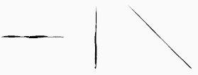
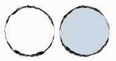
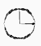
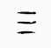
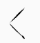
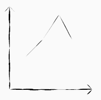
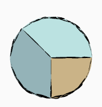

## SketchyComponent


看惯了千篇一律的风格，何不来换种感觉？   
&emsp;&emsp;&emsp;&emsp;&emsp;&emsp;&emsp;&emsp;&emsp;&emsp;&emsp;&emsp;&emsp;&emsp;&emsp;&emsp;&emsp;&emsp; --sketchy

### 什么是 SketchyComponent
SketchyComponent 是一组 *手绘风格* 的 Android 组件库。     

组件库提供了基础的手绘风格图形，以及一些常用的 Icon。    
一些示例如下：    
            

### 体验一下
[Download Demo APK](./apk/SketchyComponent.apk)

### 快速开始
#### 安装
1. 添加 jcenter 仓库（AS 创建的项目默认已经添加）
```
repositories {
    jcenter()
}
```
2. 添加 sketchy 依赖
```
implementation 'com.zylab:sketchy:0.1.3'
```

#### 基本使用
基本使用很简单，分为三步走：
``` java
// 1. 创建 Sketchy 图形
val skSquareDrawable = SkSquareDrawable().apply {
    // 2. 设置属性
    fillColor = resources.getColor(android.R.color.holo_orange_dark)
}
// 3. 给 View 设置背景
text.background = skSquareDrawable
```

### 版本更新
#### 最新版本
0.1.3

#### 0.1.3
完成基本功能

### 组件介绍
#### 基础 Model
##### SkPoint
表示图形中的一个点
* 属性   
x: Double    
y: Double    

##### SkBezier
表示一条一阶贝塞尔曲线   
* 属性   
startPoint: SkPoint    
controlPoint: SkPoint    
endPoint: SkPoint    

#### 基础 Drawable
##### SkDrawable
Drawable 基类，其他 Drawable 均继承自此类   
* 属性      
width: Double    
height: Double   
borderColor: Int   
fillColor: Int   
bgColor: Int   

##### SkSquareDrawable
绘制一个矩形  
   

* 属性     
startPoint: SkPoint (默认 (0, 0))   
squareWidth: Double (默认 Drawable 宽度)    
squireHeight: Double (默认 Drawable 高度)     

##### SkLineDrawable
绘制一个线形  
   

* 属性     
startPoint: SkPoint (默认 (0, 0))  
endPoint: SkPoint (默认 (0, Drawable width))  

##### SkCircleDrawable
绘制一个圆形  
   

* 属性  
center: SkPoint (默认 (width / 2, height / 2))  
radius: Double (默认 min(width / 2, height / 2))  

##### SkArcDrawable
绘制一个扇形  
   

* 属性   
center: SkPoint   
radius: Double    
startAngle: Double    
sweepAngle: Double    
linkCenter: Boolean    

##### SkImgDrawable
绘制图片  
   

* 属性  
img: Drawable   
style: Int (STYLE_CIRCLE, STYLE_SQUARE)  

#### 基础 Icon
##### SkTimeIcon
   

##### SkSearchIcon
   

##### SkListIcon
   

##### SkArrowIcon
        

* 属性  
style: Int (STYLE, STYLE1)  
direction: Int (UP, DOWN, LEFT, RIGHT)  

    

#### 基础图形
除此之外，我们提供了一些基础图形，方便用来自定义一些效果。下面是一些自定义的示例。   
     

##### 基础图形使用方法
我们提供的基础图形，均继承自 `SkShape`，其中提供了两个方法，`SkShape#parse` 和 `SkShape#draw(canvas: Canvas)`   
SkShape#parse 方法用来生成图形对应的路径    
SkShape#draw 方法用来将图形绘制到 canvas，如果在绘制时路径还没有生成，即 parse 方法还未调用，默认会调用 parse 方法        
以绘制直线为例：
```
// 创建 SkLine 
val line = SkLine()
// 设置属性
line.startPoint = SkPoint(0.0, 0.0)
line.endPoint = SkPoint(100.0, 100.0)
// 进行绘制
line.draw(canvas)
```

##### SkShape
所有 Shape 的基类，抽象类   
* 属性   
borderColor: Int   
fillColor: Int    
bgColor: Int    

##### SkSquare
绘制一个矩形  


* 属性  
startPoint: SkPoint   
width: Double   
height: Double   


##### SkLine
绘制一条线  


* 属性  
startPoint: SkPoint   
endPoint: SkPoint    


##### SkCircle 
绘制一个圆   


* 属性   
center: SkPoint   
radius: Double   

##### SkArc
绘制扇形  


* 属性  
center: SkPoint   
radius: Double    
startAngle: Double    
sweepAngle: Double    
linkCenter: Boolean    

##### SkCircleImg
绘制一个圆形图片  
   
* 属性  
center: SkPoint   
radius: Double   
img: Drawable   

##### SkSquareImg
绘制一个矩形图片  
   

* 属性  
startPoint: SkPoint   
width: Double    
height: Double    
img: Drawable    

### 关于
有任何问题或建议，欢迎反馈：   
邮箱：zy5a59@outlook.com    
微信：zy_lab