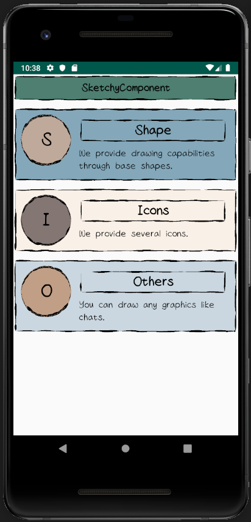
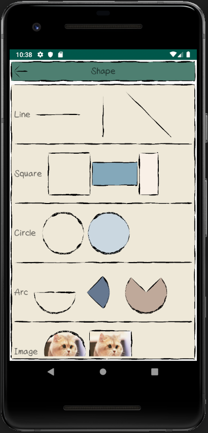
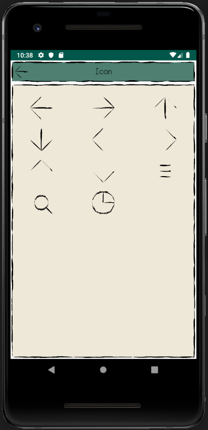
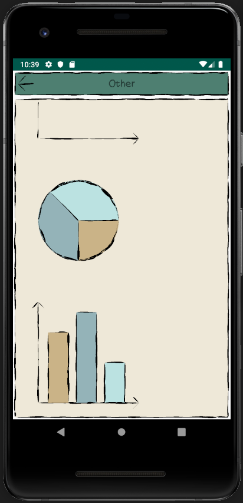

SketchyComponent

受够了千篇一律的设计风格，何不来换种感觉？   

### 什么是 SketchyComponent
SketchyComponent 是一组手绘风格的 Android 组件库。   
组件库提供了基础的手绘风格图形，以及一些常用的 Icon。  
一些示例如下：    
   
   
   
   

### 体验一下

### 快速开始
#### 安装
gradle install

#### 基本使用

#### 基础图形

#### 基础 Drawable

#### 基础 Icon
