## SketchyComponent
Languate: [中文](./README-CN.md) | [English](./README.md)   

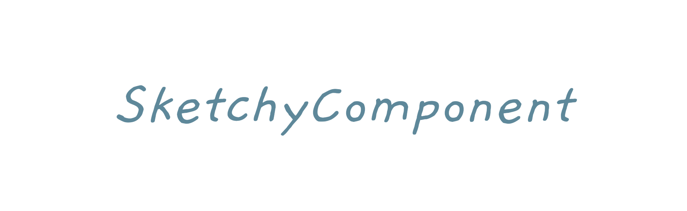

### What is SketchyComponent
SketchyComponent is a set of *sketchy style* components.

We provide basic sketchy shapes and some icons.   
Here are some examples：    
            

### Try
[Download Demo APK](./apk/SketchyComponent.apk)

### Quick Start
#### Install
1. add `jcenter` to repositories
```
repositories {
    jcenter()
}
```
2. add `sketchy` to dependencies
```
implementation 'com.zylab:sketchy:0.1.1'
```

#### How to use
``` java
// 1. new SkDrawable
val skSquareDrawable = SkSquareDrawable().apply {
    // 2. set props
    fillColor = resources.getColor(android.R.color.holo_orange_dark)
}
// 3. set the background of View 
text.background = skSquareDrawable
```

### Update
#### Latest version
0.1.1

#### 0.1.1 
Complete basic functions.

### Introduce
#### Basic Model
##### SkPoint
Represents a point in the drawing.   
* Props   
x: Double    
y: Double   

##### SkBezier
Represents a first order Bezier curve.
* Props   
startPoint: SkPoint    
controlPoint: SkPoint    
endPoint: SkPoint    

#### Basic Drawable
##### SkDrawable
The base class of other SkDrawables.    
* Props      
width: Double    
height: Double   
borderColor: Int    
fillColor: Int    
bgColor: Int    

##### SkSquareDrawable
A drawable of square.   
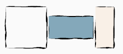   

* props     
startPoint: SkPoint (The default value is (0, 0))   
squareWidth: Double (The default value is the width of drawable)    
squireHeight: Double (The default value is the height of drawable)   

##### SkLineDrawable
A drawable of line.   
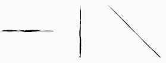   

* Props     
startPoint: SkPoint (The default value is (0, 0))  
endPoint: SkPoint (The default value is (0, Drawable width))  

##### SkCircleDrawable
A drawable of circle.   
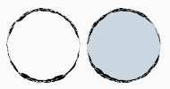   

* Props  
center: SkPoint (The default value is (width of drawable / 2, height of drawable / 2))  
radius: Double (The default value is min(width of drawable / 2, height of drawable / 2))  

##### SkArcDrawable
A drawable of arc.    
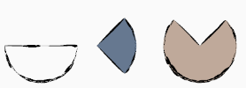   

* Props   
center: SkPoint   
radius: Double   
startAngle: Double    
sweepAngle: Double    
linkCenter: Boolean (Whether if line to center)   

##### SkImgDrawable
A drawable of images.   
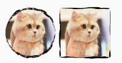   

* 属性  
img: Drawable    
style: Int (STYLE_CIRCLE and STYLE_SQUARE)  

#### Basic Icon
##### SkTimeIcon
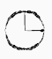   

##### SkSearchIcon
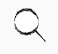   

##### SkListIcon
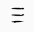   

##### SkArrowIcon
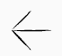 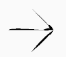 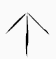   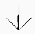 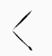 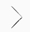 

* Props  
style: Int (STYLE, STYLE1)  
direction: Int (UP, DOWN, LEFT, RIGHT)  

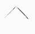 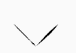   

#### Basic Shape
We also provide custom capabilities by some basic shapes. So You can draw something you want using these shapes.      
Here are some examples.   

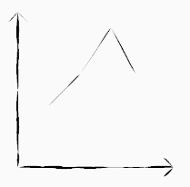 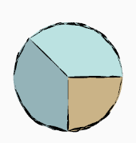 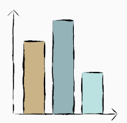   

##### How to use
All basic shapes inherit from `SkShape`. There are two important functions -- `SkShape#parse()` and `SkShape#draw(canvas: Canvas)`.    
`SkShape#parse` used to generate paths of graphics.   
`SkShape#draw` used to draw paths to canvas. It will call `parse` if paths are not generated.  
Take SkLine as an example：
```
// 1. new SkLine 
val line = SkLine()
// 2. set props
line.startPoint = SkPoint(0.0, 0.0)
line.endPoint = SkPoint(100.0, 100.0)
// 3. draw to canvas
line.draw(canvas)
```

##### SkShape
The base class of shapes.   
* Props    
borderColor: Int   
fillColor: Int    
bgColor: Int    

##### SkSquare
A shape of square.   


* Props   
startPoint: SkPoint    
width: Double   
height: Double   


##### SkLine   
A shape of line.   


* Props     
startPoint: SkPoint   
endPoint: SkPoint    


##### SkCircle 
A shape of circle.   


* Props   
center: SkPoint    
radius: Double    

##### SkArc
A shape of arc.   


* Props    
center: SkPoint   
radius: Double    
startAngle: Double    
sweepAngle: Double    
linkCenter: Boolean    

##### SkCircleImg
A shape of circle images.   
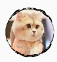   

* Props     
center: SkPoint    
radius: Double    
img: Drawable   

##### SkSquareImg
A shape of square images.   
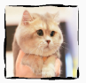   

* Props     
startPoint: SkPoint   
width: Double   
height: Double    
img: Drawable    

### About
Any questions or suggestions, welcome to feedback:    
Email：zy5a59@outlook.com    
Wechat：zy_lab   